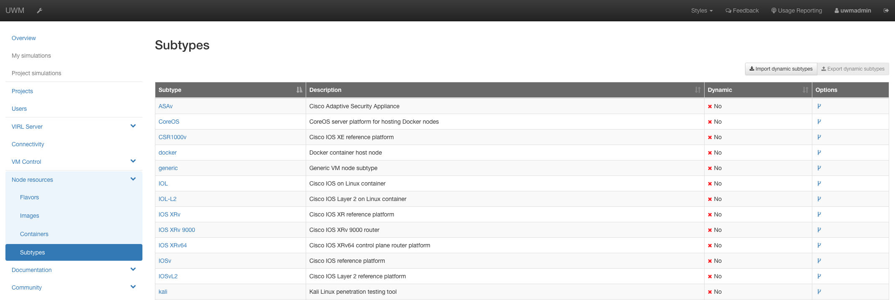
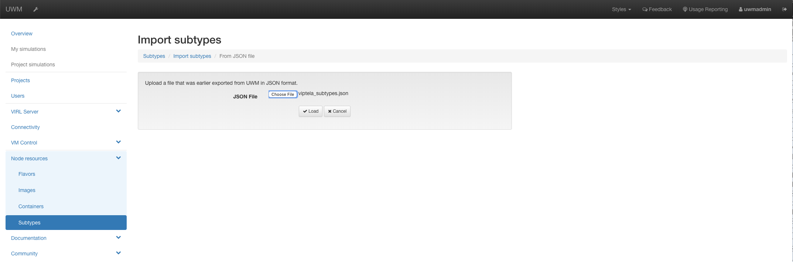
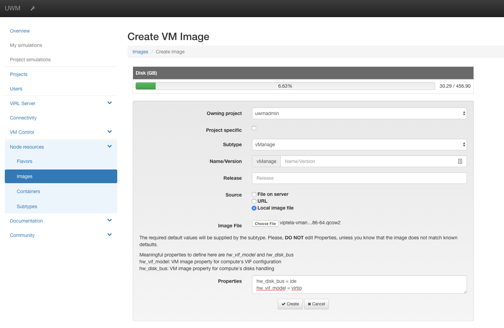
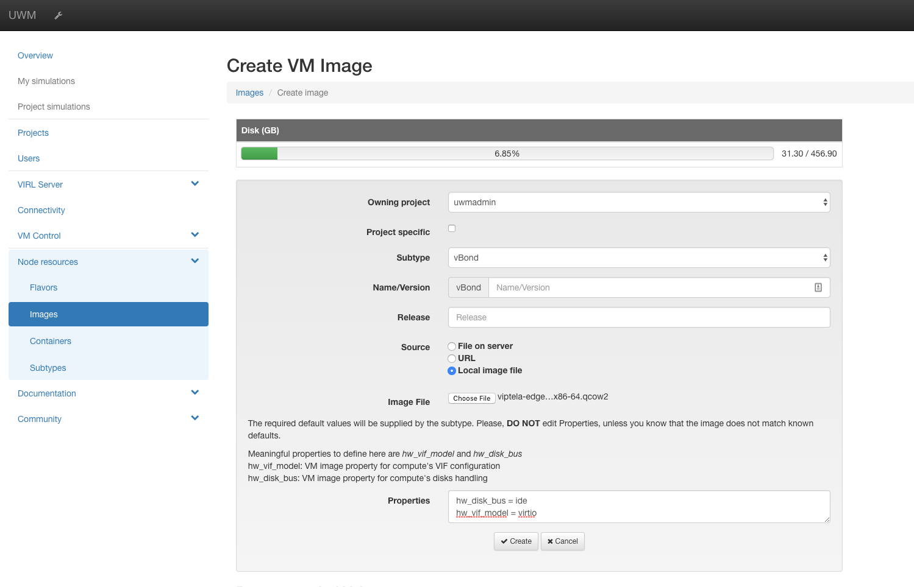

# How to Configure VIRL for Viptela

## Create Flavors
The current VIRL API does not support creating flavors with ephemeral storage, so you must ssh to the VIRL servers as the user `virl` and run the following:

```
openstack flavor create --vcpus 4 --ram 8192 --disk 20 --ephemeral 20 vManage
openstack flavor create --vcpus 2 --ram 2048 --disk 11 vBond
openstack flavor create --vcpus 2 --ram 2048 --disk 11 vSmart
openstack flavor create --vcpus 2 --ram 2048 --disk 11 vEdge
```

## Add SubTypes
Goto Node Resources->Subtypes and choose `Import dymanic subtypes` in the upper right hand corner.

The import the file `viptela_subtypes.json` from the repo:


## Add Images
When creating the images, specify the following in `Properties`:

```angular2html
hw_disk_bus = ide
hw_vif_model = virtio
```

Add an image for each of the 4 VM types (vManage, vBond, vSmart, & vEdge).  Note that the same qcow is used for both vBond and vEdge.  The images can be downloaded from The [Viptela Support Site](http://support.viptela.com/)

### Viptela support is being migrated to Cisco support.  If you don't have permission to download from the site above, please try to obtain the qcow's here instead [Cisco Support](https://software.cisco.com/download/home/286320995/type)

### vManage

### vBond

### vSmart

### vEdge


If you want an example of a Viptela topology on VIRL, look [here](https://github.com/virlfiles/sdwan)
